# 💬 ChatWave — Real-Time Chat App

Full-stack real-time chat with friends system and group chats built on **React + Express + Supabase + Socket.io**.
---

## ✨ Features

- 🔐 Auth (register / login / logout via Supabase)
- 👤 User profiles (editable display name, bio, avatar)
- 🔍 Search users by username
- 🤝 Friend requests (send / accept / decline)
- 💬 1-on-1 DM conversations
- 👥 Group chats (create, add/remove members, admin roles)
- ⚡ Real-time messaging via Socket.io
- ⌨️  Typing indicators
- 🟢 Online presence
- 💾 All messages persisted in Supabase

## 🏗️ Tech Stack

<h2> 🚀 &nbsp;Some Tools I Have Used and Learned</h2>
<p align="left">


</p>

## Features
<div display="flex" >
  <div>
      <p>Login</p>
      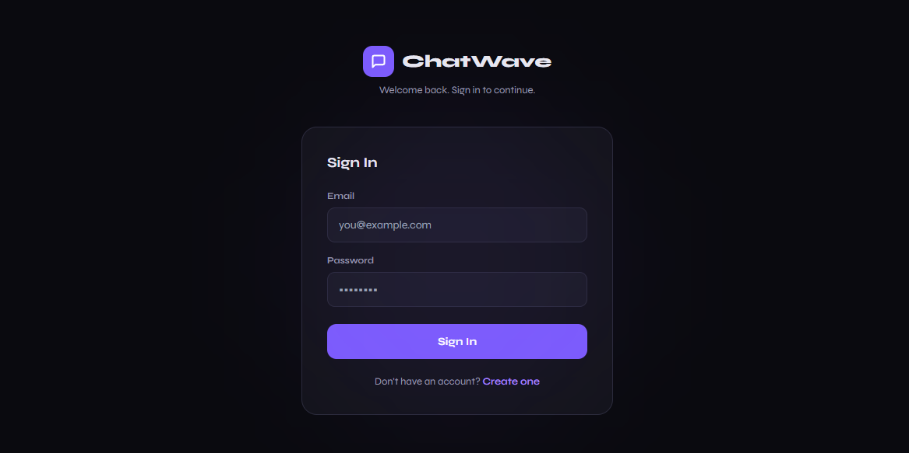
  </div>
   <div>
      <p>Signup/Register</p>
      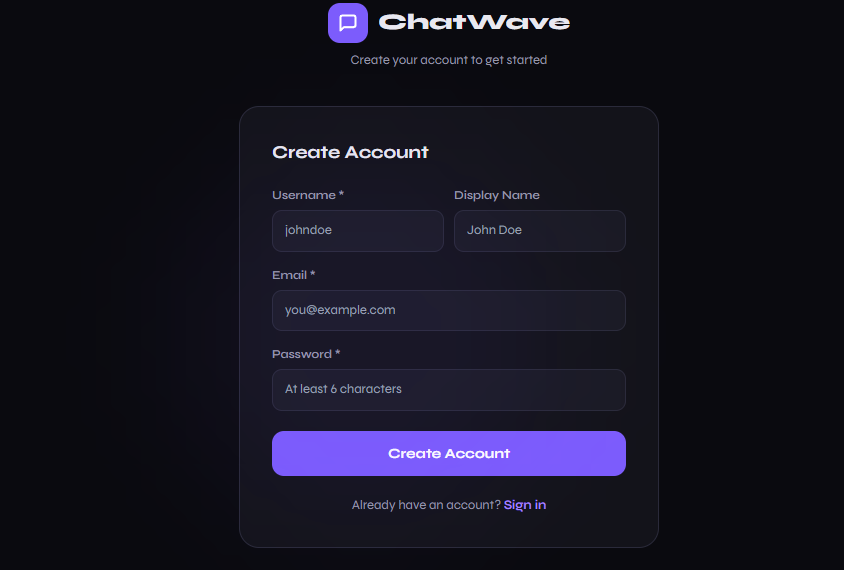
  </div>
  <div>
      <p>Edit profile</p>
      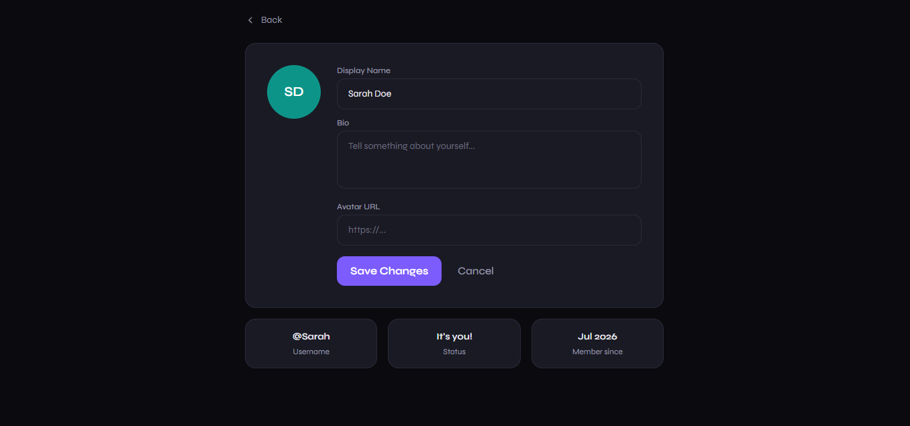
  </div>
  <div>
      <p>Set Vibe</p>
      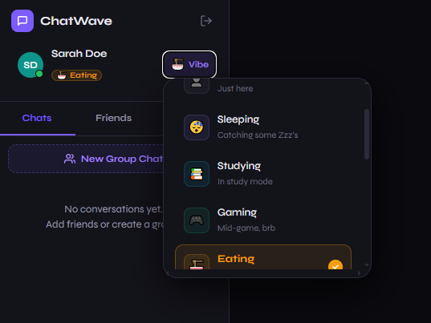
  </div>
  <div>
      <p>Add Friends</p>
      
  </div>
  <div>
      <p>Chat</p>
      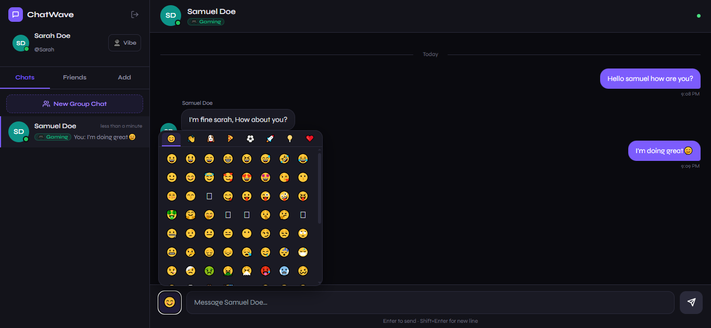
  </div>
  <div>
      <p>Create Group Chat</p>
      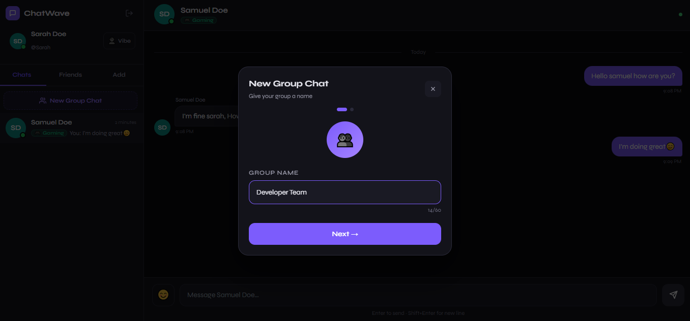
  </div>
  <div>
      <p>Add Members</p>
      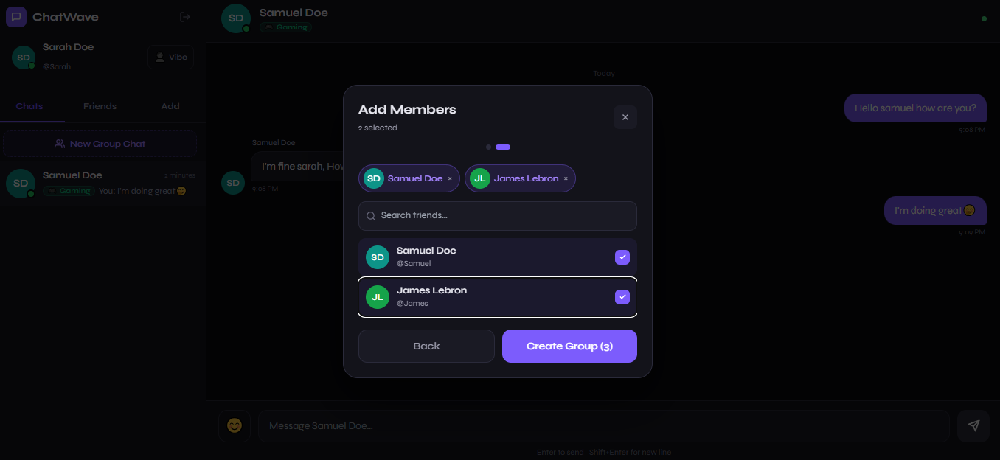
  </div>
  <div>
      <p>Chat Members</p>
      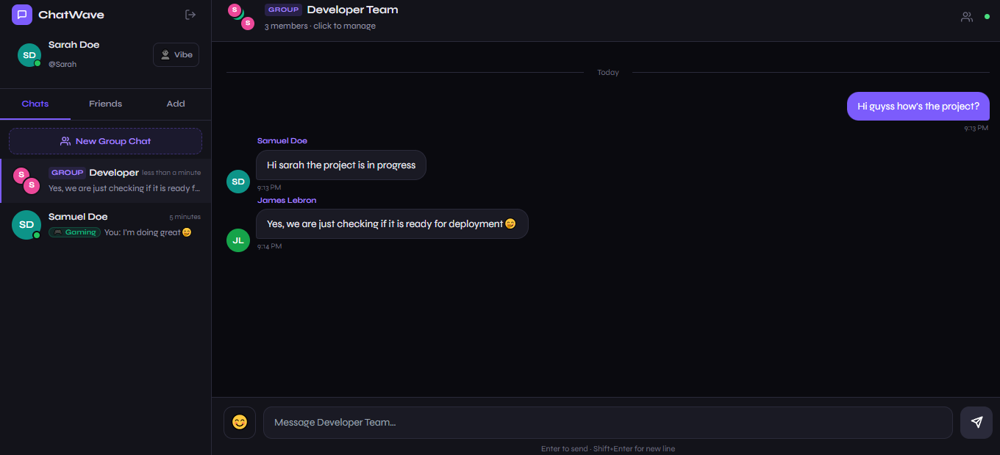
  </div>
  <div>
      <p>See list of friends</p>
      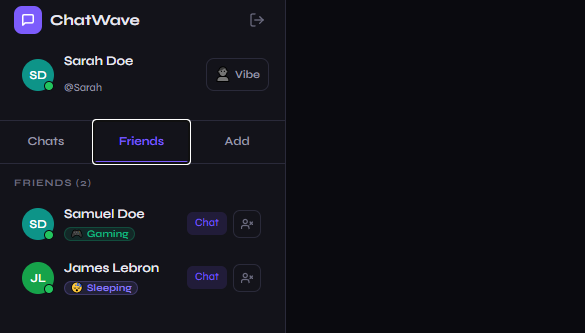
  </div>
  <div>
      <p>See pending Request</p>
      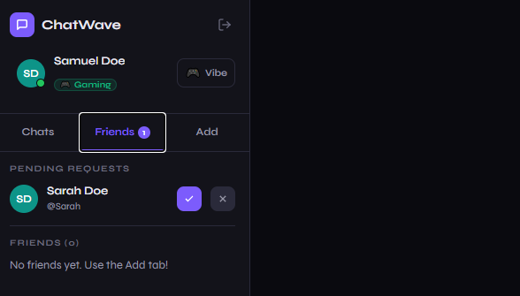
  </div>
  <div>
      <p>Role based group chat admin/member</p>
      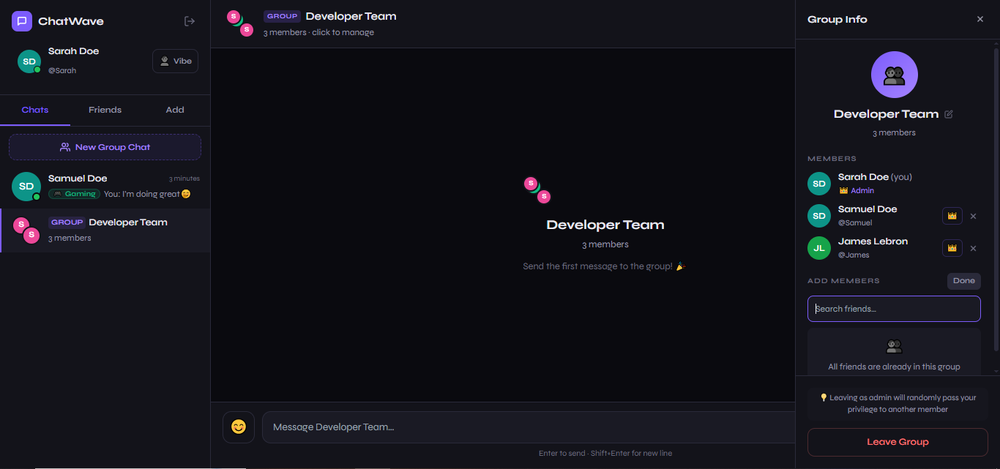
  </div>
</div>


---
## 🚀 Local Development

### 1. Install dependencies

```bash
cd server && npm install
cd ../client && npm install

### 2. Run both servers

```bash
# Terminal 1
cd server && npm run dev

# Terminal 2
cd client && npm run dev
```

Open `http://localhost:5173`

---


## 📊 Performance & Stress Testing 
To ensure ChatWave can handle real-world scale, we conducted a rigorous stress test using Apache JMeter. We simulated a high-concurrency environment to evaluate how the system performs under significant load.  Test ConfigurationSimulated Users: 1,000 concurrent users.  Total Requests: 10,000 requests distributed across 9 key API endpoints.  Scenario: The test covered a complete user journey, including authentication, social interactions, real-time messaging, and profile management.

## Metric,Result,Interpretation
Error Rate,0.00%,The system maintained perfect stability with zero failed requests under full load. 
Average Response Time,253 ms,"Typical user requests were processed in under 300ms, ensuring a ""snappy"" experience. 
Throughput,127.3 req/sec,The system successfully managed over 127 transactions every second. 
Network Efficiency,103.2 KB/s,"Data flow remained optimized, with the largest payloads occurring during conversation fetches.


## Performance Testing — Apache JMeter
Performance at Scale
Our platform was put through rigorous load testing across 10,000 requests spanning 10 key operations and delivered a 0.00% error rate across the board. With an average response time of just 344ms and a total throughput of 151.9 requests/second, the system handles real-world demand with consistency and reliability. Peak loads reaching up to 24,592ms were absorbed without a single failure, demonstrating the robustness of our infrastructure under stress.


Detailed Endpoint Performance:
Endpoint,# Samples,Avg (ms),Min (ms),Max (ms),Std. Dev.
Online Users,"1,000",13,0,210,24.65
Profile/Login,"1,000",196,94,"1,440",144.11
List Friends,"1,000",213,97,"2,863",215.56
Get Messages,"1,000",388,195,"6,551",334.77
List of Conversations,"1,000",983,437,"20,364",962.28
Update Profile,"1,000",226,96,"13,657",587.60

## Parallel & Distributed System Analysis

-High Throughput & Concurrency: The system's ability to handle 1,000 concurrent users with 0.00% errors confirms the effectiveness of our Event-Driven architecture (Socket.io) and Asynchronous API handling (Express async/await).


